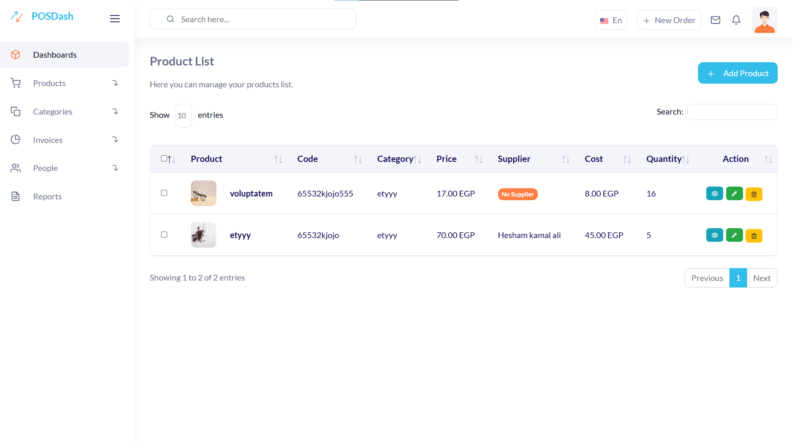
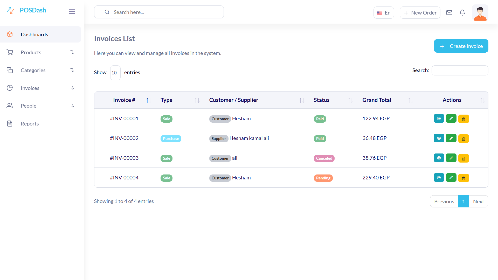
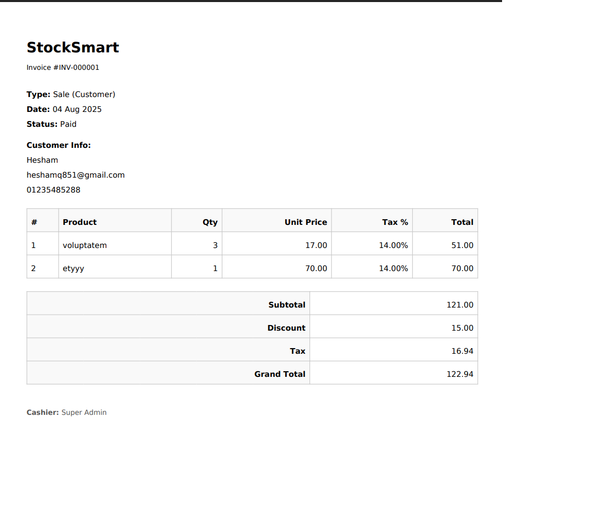
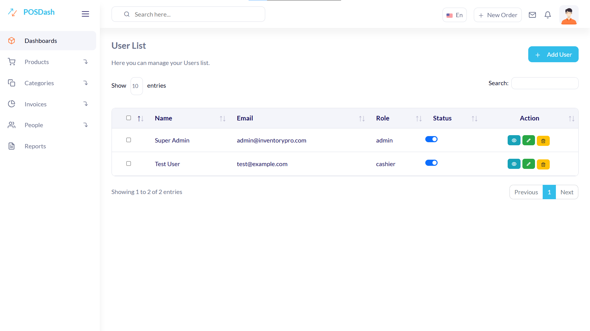

# 📦 Stock-Master

**Stock-Master** is an inventory and invoice management system designed to help small and medium-sized businesses manage products, customers, suppliers, and invoices professionally and easily.

---

## ✨ Features

- 🛒 **Product Management** (Add / Edit / Delete)
- 📊 **Dynamic Statistical Dashboard**
  - Animated Counters
  - Low Stock Alerts
  - Real-time Daily Sales
- 🗂️ **Category Management**
- 🧾 **Professional Invoice System**
  - Sales and Purchase Invoices
  - Discounts, Taxes, and Professional PDF Printing
- 👨‍💼 **Customer & Supplier Management**
  - Live Email Validation
- 🔐 **Login System & User Management (Admins & Cashiers)**
- ✅ **Live Stock Validation During Invoice Creation/Editing**
- 🧮 **Detailed Sales & Inventory Reports**

---

## 🛠️ Technologies Used

- **Laravel 11**
- **Blade Templates**
- **Bootstrap 5**
- **TomSelect.js**
- **Chart.js** for Charts
- **DOMPDF** for PDF Invoices
- **SweetAlert2** for Interactive Alerts
- **AJAX** for Live Validation

---

## 🔑 Default Admin Credentials

When running `php artisan migrate --seed`, a Super Admin user is automatically created with:

| Email                   | Password        |
|------------------------|-----------------|
| admin@inventorypro.com | Inventory@2025  |

- You can login with these credentials and change the password later
- Account is created with **Admin** privileges
- **force_password_change** can be managed through admin panel

⚠️ **Important**: We strongly recommend changing the password after first login in production.


## 📷 Screenshots

### Dashboard Overview
[](screenshots/dashboard.png)

### Products Management
[](screenshots/products.png)

### Invoices List
[](screenshots/invoices.png)

### Invoice PDF Preview
[](screenshots/invoice-print.png)

### User Management 
[](screenshots/users.png)


## 🚀 Installation Steps

```bash
# 1. Clone the repository
git clone https://github.com/heshamkamal7/Stock-Master.git
cd Stock-Master

# 2. Install dependencies
composer install
npm install
npm run build

# 3. Setup environment file
cp .env.example .env
php artisan key:generate

# 4. Configure database in .env file

# 5. Run migrations and seeders
php artisan migrate --seed

# 6. Start the server
php artisan serve
```

## 👨‍💻 Developer
Hesham Kamal

---

## 📝 License
This project is open-source and available under the MIT License.

## 💡 Additional Notes

- System is for internal management only (Admins & Cashiers)
- No front-end interface for end users
- Built flexibly to allow future features such as:
  - Profit Reports
  - Advanced Roles & Permissions
  - API Integration with other systems


# 📦 نظام إدارة المخزون

**Stock-Master** هو نظام متكامل لإدارة المخزون والفواتير مصمم لمساعدة المتاجر الصغيرة والمتوسطة في إدارة المنتجات، العملاء، الموردين، والفواتير بشكل احترافي وسهل.

---

## ✨ المميزات

- 🛒 **إدارة المنتجات**
  - إضافة منتجات جديدة
  - تعديل المنتجات الحالية
  - حذف المنتجات
- 📊 **لوحة تحكم إحصائية**
  - عدادات متحركة
  - تنبيهات المخزون المنخفض
  - مبيعات اليوم لحظياً
- 🗂️ **إدارة التصنيفات**
- 🧾 **نظام فواتير احترافي**
  - فواتير بيع وشراء
  - خصومات وضرائب
  - طباعة PDF باحترافية
- 👨‍💼 **إدارة العملاء والموردين**
  - تحقق فوري من البريد الإلكتروني
- 🔐 **نظام إدارة المستخدمين**
  - مدراء النظام
  - موظفي الكاشير
- ✅ **تحقق لحظي من المخزون**
- 🧮 **تقارير مفصلة**

---

## 🛠️ التقنيات المستخدمة

- **Laravel 11**
- **Blade Templates**
- **Bootstrap 5**
- **TomSelect.js**
- **Chart.js** للرسوم البيانية
- **DOMPDF** لطباعة الفواتير
- **SweetAlert2** للتنبيهات التفاعلية
- **AJAX** للتحقق اللحظي

---

## 🔑 بيانات الدخول الافتراضية

عند تشغيل `php artisan migrate --seed`، يتم إنشاء حساب مدير النظام تلقائياً:

| البريد الإلكتروني        | كلمة المرور      |
|-------------------------|------------------|
| admin@inventorypro.com  | Inventory@2025   |

- يمكنك تسجيل الدخول بهذه البيانات وتغيير كلمة المرور لاحقاً
- الحساب منشأ بصلاحيات **مدير النظام**
- يمكن إدارة خاصية **تغيير كلمة المرور الإجباري** من لوحة التحكم

⚠️ **هام**: نوصي بشدة بتغيير كلمة المرور بعد أول تسجيل دخول في بيئة الإنتاج.


## 📷 لقطات الشاشة

### لوحة التحكم
[](screenshots/dashboard.png)

### إدارة المنتجات
[](screenshots/products.png)

### قائمة الفواتير
[](screenshots/invoices.png)

### معاينة الفاتورة PDF
[](screenshots/invoice-print.png)

### إدارة المستخدمين
[](screenshots/users.png)


## 🚀 خطوات التثبيت

```bash
# 1. نسخ المشروع
git clone https://github.com/heshamkamal7/Stock-Master.git
cd Stock-Master

# 2. تثبيت المتطلبات
composer install
npm install
npm run build

# 3. إعداد ملف البيئة
cp .env.example .env
php artisan key:generate

# 4. إعداد قاعدة البيانات في ملف .env

# 5. تشغيل الترحيلات والبيانات الأولية
php artisan migrate --seed

# 6. تشغيل الخادم
php artisan serve
```

## 👨‍💻 المطور
هشام كمال

---

## 📝 الترخيص
هذا المشروع مفتوح المصدر ومتاح تحت رخصة MIT.

## 💡 ملاحظات إضافية

- النظام مخصص للإدارة الداخلية فقط (المدراء والكاشير)
- لا يحتوي على واجهة أمامية للمستخدمين النهائيين
- مصمم بمرونة لإضافة مميزات مستقبلية مثل:
  - تقارير الأرباح
  - نظام صلاحيات متقدم
  - واجهة برمجية للتكامل مع الأنظمة الأخرى

